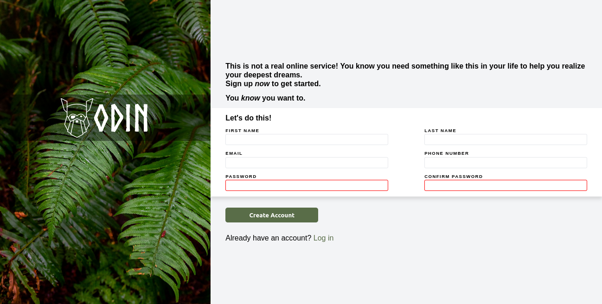

# Sign Up Form Practice Project

This project is a simple sign-up form for a fictitious website. It's designed to help you practice building and styling forms while using flexbox for layout.

[Link to Project Description on The Odin Project](https://www.theodinproject.com/lessons/node-path-intermediate-html-and-css-sign-up-form)

## Live Preview

[Live Preview](https://tonyfred-code.github.io/project-sign-up-form/)

## Installation

Instructions for installing and running the project locally, if applicable.

## Usage

The project allows you to practice various aspects of building a sign-up form, including form fields, labels, and button styling. You can use this project to enhance your form-building and flexbox skills.

## Technologies Used

- HTML and CSS for form structure and styling.
- Flexbox for layout design.

## License

This project is licensed under the [MIT License](LICENSE).

## Acknowledgments

Leaf background image by [Halie West](https://unsplash.com/photos/25xggax4bSA) on [Unsplash](https://unsplash.com).